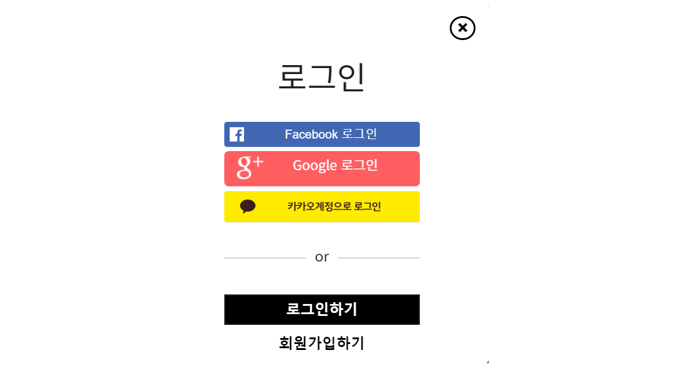
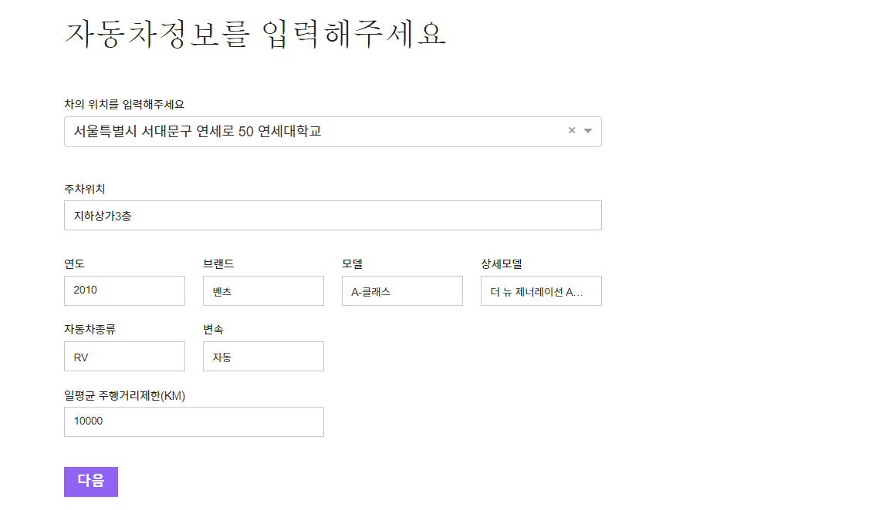
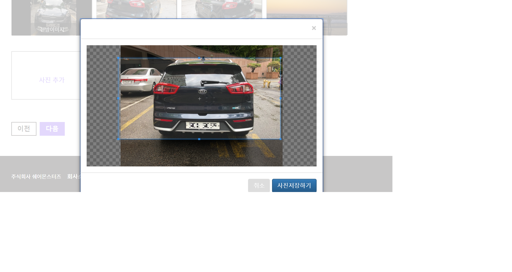
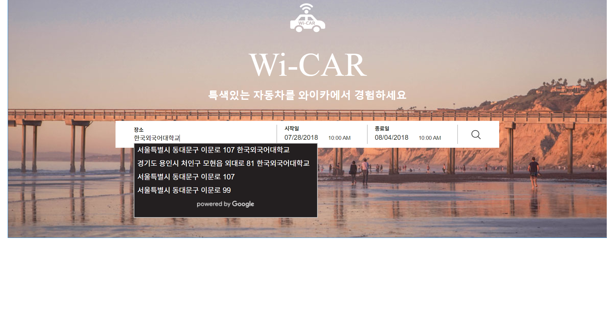
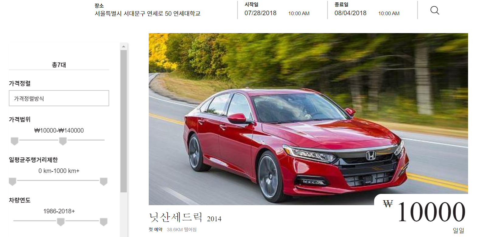
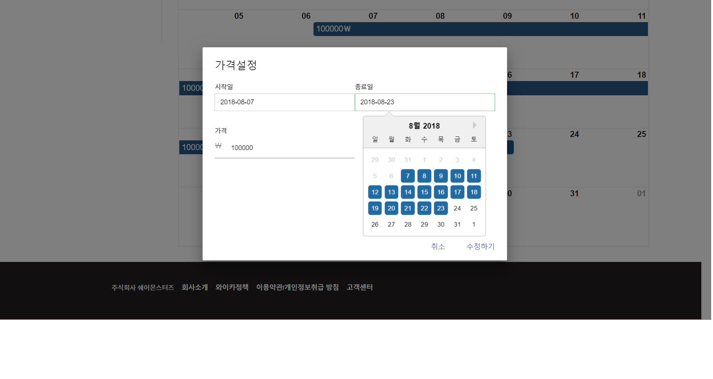

# Wicar Project
Wicar is a P2P carsharing web-app platform consists of wicarwebapp and wicar admin webapp

 ## Prerequisites

* You need to prepare few external api secrets to fully utilize this web.

  * [Google Login API](https://developers.google.com/identity/protocols/OAuth2ServiceAccount) secrets and save it as client_secret.json

  * [Facebook Login API](https://developers.facebook.com/docs/facebook-login/overview) secrets and saved it as fb_client_secret.json.

  * [KAKAOTALK Api](https://developers.kakao.com/) secrets and saved it inside settings.py

  * [Bluehouse Lab API](http://www.bluehouselab.com/) secrets and saved it inside settings.py

 ## Getting Started
 * You can start this project with simple
`docker-compose up ` commands.

## Wicar Characteristics

* Easy to login and signup.

  

* Car owners are easy to register car with various images.

<table>
    <tr>
        <td></td>
        <td></td>
    </tr>
</table>

* Car renters can find cars they want with user-friendly conditions.

<table>
    <tr>
        <td></td>
        <td></td>
    </tr>
</table>

* Car owners can set their daily car price and car vacation easily so they can make maximum profit they want.

## License

React is [MIT licensed](./LICENSE).
